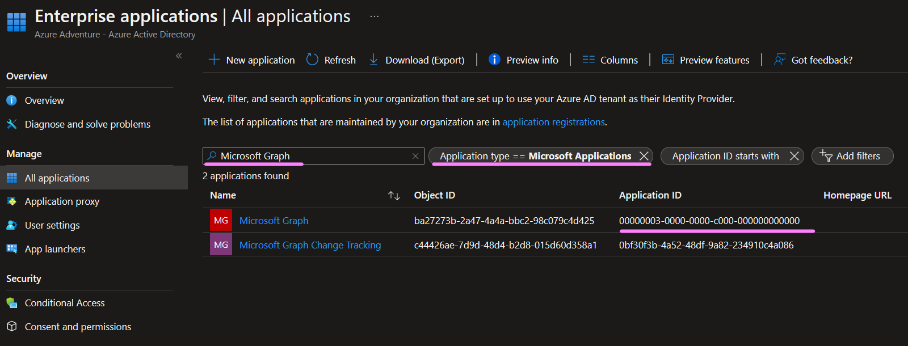

+++ 
draft = false
date = 2023-01-28
title = "Azure - using az cli to add API permissions to a service principal"
description = ""
slug = ""
authors = []
tags = []
categories = []
externalLink = ""
series = []
+++

# The why

Running terraform through CI agents requires a service principal to be created. When using the azuread provider it is needed to grant the service principal certain permissions for it to function. The manual steps are documented here. However, in my case, I have a script that automatically sets up the service principal for terraform as well as the needed resources for the storage of the state file. I always prefer to have configuration steps scripted and in version control. This allows for reviews of future changes and reduces the chances of human error. Also, checklists and wiki articles are pretty terrible in my experience.

# The how

## Creating a new service principal and getting the application ID

The documentation for this command is [here](https://learn.microsoft.com/en-us/cli/azure/ad/sp?view=azure-cli-latest#az-ad-sp-create-for-rbac). It’s possible to add scope to this command and it will create a role assignment as well. Piping the response to `ConvertFrom-Json -AsHashtable` will make it more convenient to utilize the values later on.

``` powershell
param (
    [Parameter(Mandatory=$true)]
    [string]
    $appName
)

$credentials = $(az ad sp create-for-rbac -n $appName | ConvertFrom-Json -AsHashtable)
```

## Getting the application ID from an existing service principal

``` powershell
param (
    [Parameter(Mandatory=$true)]
    [string]
    $appName
)

$appId=$(az ad app list --display-name $appName --query [].appId -o tsv)
```

The `--query` flag will allow us to get the app ID that we need. `-o tsv` will return the value only. Without it, the application ID would be wrapped with quotes.

## Adding API permissions

Adding API permissions [az ad app permission add](https://learn.microsoft.com/en-us/cli/azure/ad/app/permission?view=azure-cli-latest#az-ad-app-permission-add)

Reading the guide for azuread linked earlier in this article it says when utilizing `azuread_group` resource the service principal needs `Group.ReadWrite.All` permissions. The command az needed would be this.

``` bash
az ad app permission add --id $credentials["appId"] --api 00000003-0000-0000-c000-000000000000 --api-permissions 62a82d76-70ea-41e2-9197-370581804d09=Role #Group.ReadWrite.All
```

We can plug in the application ID we got earlier.

The `--api` flag will require the id of the target resource application in our case which is Microsoft Graph. It is listed in the command documentation, but to find it yourself head to enterprise applications inside azure ad then click All applications. You will have to change the application type filter for it to show up.



`--api-permissions` will contain one or more permissions. The format will be `{permissionId}=role` role means it will be an application type which is what we need based on the azuread provider documentation. Reference the Microsoft documentation for more details regarding this flag. The permission IDs can be found here. Running a search on this page for `Group.ReadWrite.All` will find the permission. Make sure to copy the id for one with application type in this case the ID is `62a82d76–70ea-41e2–9197–370581804d09`

You can separate the permissions with spaces and add multiple ones. Here is an example.

``` bash
az ad app permission add --id $credentials["appId"] --api 00000003-0000-0000-c000-000000000000 --api-permissions 62a82d76-70ea-41e2-9197-370581804d09=Role 7ab1d382-f21e-4acd-a863-ba3e13f7da61=Role
```

After running the command it will take a minute or two for them to appear in the Azure portal. Also, you will receive a warning like this.

```
Invoking `az ad app permission grant --id <appId> --api 00000003-0000-0000-c000-000000000000` is needed to make the change effective
```

This is expected since the permissions added require admin consent before they are active.

## Granting consent

The warning is very confusing since it instructs to run `az ad app permission grant` if you try you will notice that it requires a `--scope` flag. Then looking up that command on the documentation page you will see that the command is for delegated permission types and not application. For application-typed permissions, it is needed to use `az ad app permission admin-consent` command. This took some time for me to realize. So disregard the warning completely.

``` powershell
az ad app permission admin-consent --id $credentials["appId"]
```

After running the command and waiting a minute or two the status will change from not granted to granted.

# Full example script

``` powershell
param (
    [Parameter(Mandatory=$true)]
    [string]
    $appName
)

$credentials = $(az ad sp create-for-rbac -n $appName | ConvertFrom-Json -AsHashtable)

az ad app permission add --id $credentials["appId"] --api 00000003-0000-0000-c000-000000000000 --api-permissions 62a82d76-70ea-41e2-9197-370581804d09=Role 7ab1d382-f21e-4acd-a863-ba3e13f7da61=Role

az ad app permission admin-consent --id $credentials["appId"]
```
