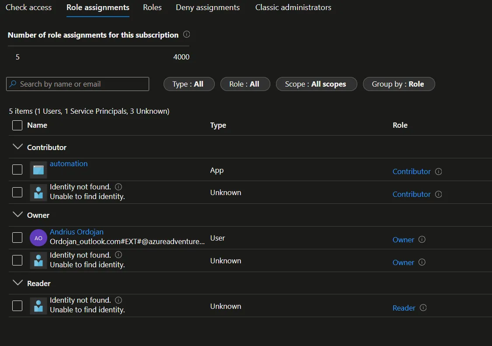

+++ 
draft = false
date = 2023-02-10
title = "Azure - delete role assignments that do not have a principal"
description = ""
slug = ""
authors = []
tags = []
categories = []
externalLink = ""
series = []
+++

# Description of the problem

In Azure, when a principal gets deleted it leaves the role assignments untouched. The assignment name gets changed to “Identity not found” which makes sense. It looks like this.



The issue is it easily can get messy. Readability of the “Access control” section degrades and, because of inheritance, the messiness will possibly propagate downstream. Luckily, this seems very possible to fix with scripting.

# Solution implementation

The course of action for the script is to query all the role assignments, then select the ones without a principal and delete them.

## Finding role assignments without a principal

First command to run will be to list all the role assignments. [Here](https://learn.microsoft.com/en-us/cli/azure/role/assignment?view=azure-cli-latest#az-role-assignment-list) is the documentation for it.

``` powershell
az role assignments list --all
```

By default it will scope it to the subscription, adding the flag `--all` will give us all the role assignments. Running will return JSON that looks like this.

``` json
[
  {
    "canDelegate": null,
    "condition": null,
    "conditionVersion": null,
    "description": null,
    "id": "/subscriptions/1d722906-d6a0-45d5-8379-6f7138bcce5b/providers/Microsoft.Authorization/roleAssignments/5add4c11-7b8d-4361-9315-057cd462baf9",
    "name": "5add4c11-7b8d-4361-9315-057cd462baf9",
    "principalId": "69860fa5-8b13-400a-9bf1-9f3c99f142df",
    "principalName": "177ba90b-e40c-4b61-b620-27a89309fcaf",
    "principalType": "ServicePrincipal",
    "roleDefinitionId": "/subscriptions/1d722906-d6a0-45d5-8379-6f7138bcce5b/providers/Microsoft.Authorization/roleDefinitions/b24988ac-6180-42a0-ab88-20f7382dd24c",
    "roleDefinitionName": "Contributor",
    "scope": "/subscriptions/1d722906-d6a0-45d5-8379-6f7138bcce5b",
    "type": "Microsoft.Authorization/roleAssignments"
  },
  {
    "canDelegate": null,
    "condition": null,
    "conditionVersion": null,
    "description": null,
    "id": "/subscriptions/1d722906-d6a0-45d5-8379-6f7138bcce5b/providers/Microsoft.Authorization/roleAssignments/f3699f90-f547-40c7-8c34-f1bedb6e8eb4",
    "name": "f3699f90-f547-40c7-8c34-f1bedb6e8eb4",
    "principalId": "a8a09c9a-f3a9-4a97-9467-9e975a57356a",
    "principalName": "",
    "principalType": "ServicePrincipal",
    "roleDefinitionId": "/subscriptions/1d722906-d6a0-45d5-8379-6f7138bcce5b/providers/Microsoft.Authorization/roleDefinitions/b24988ac-6180-42a0-ab88-20f7382dd24c",
    "roleDefinitionName": "Contributor",
    "scope": "/subscriptions/1d722906-d6a0-45d5-8379-6f7138bcce5b",
    "type": "Microsoft.Authorization/roleAssignments"
  }
]
```

From the response, it’s clear that the role assignments where the property called `PrincipalName` is empty are the ones that need to be deleted. Service principals use the application ID for the principal name and users will have the user principal name listed.

Looking at the delete command, it takes in one or more IDs for selection.

``` powershell
az role assignment delete --ids <IDs>
```

So we have to select IDs of objects where the principal name is an empty string. To do that we can use the `--query` argument. It is available in all az commands and can be used select the exact property that is needed. [Here](https://learn.microsoft.com/en-us/cli/azure/query-azure-cli) is the documentation page.

```
--query [?principalName==``""``].id
```

Making the query is straightforward, but the double ticks are a bit confusing. Here is the explanation lifted from the documentation page.

> These extra escape characters are present because Azure CLI commands are considered Command Prompt scripts, so both PowerShell and Command Prompt's parsing need to be taken into consideration. Azure CLI will only receive a symbol if it still exists after 2 rounds of parsing. For more information about other possible quoting issues please see [Quoting issues with PowerShell](https://github.com/Azure/azure-cli/blob/dev/doc/quoting-issues-with-powershell.md).

That’s a little gotcha, but nice that it’s documented.

Setting the output to `tsv` will sanitize it so we can easily use it as an argument. [Here](https://learn.microsoft.com/en-us/cli/azure/format-output-azure-cli#tsv-output-format) is the documentation section on it. In this case, instead of a JSON array, we will get a plain values separated by newlines.

The final command is this. It will return all role assignments without that do not have a principal.

``` 
az role assignment list --all --query [?principalName==``""``].id --output tsv  
```

## Deleting role assignments

You can copy the IDs and paste them into the delete command. If however, you want to save them to a variable and use that in the delete command, there is a caveat. It’s called splatting. You can read more about it [here](https://learn.microsoft.com/en-us/powershell/module/microsoft.powershell.core/about/about_splatting?view=powershell-7.3), but in short it tells PowerShell that you are passing a collection of values. In practice, it means you use an `@` symbol instead of `$` when referencing the variable. The command to delete the role assignments would look like this.

``` powershell
az role assignment delete --ids @ids
```

# Sample script

Here are the two commands in a single code block.

``` 
$ids = az role assignment list --all --query [?principalName==``""``].id --output tsv
az role assignment delete --ids @ids
```
